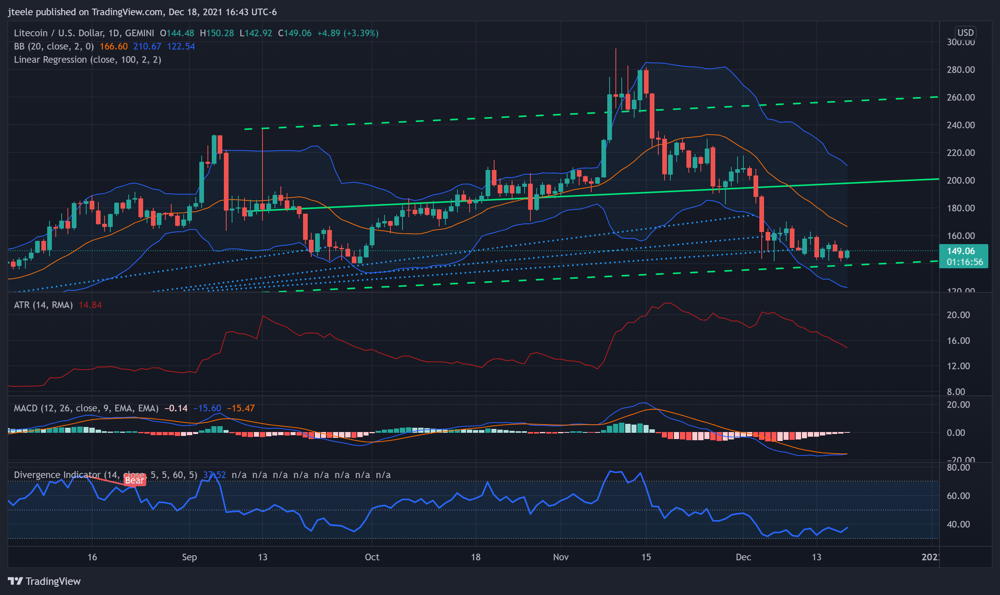

## *Crypto Market Screener with Dashbaord Visualizations*

>### Combine the power of Python & Trading View to identify strong performers in the Market

&nbsp;&nbsp;&nbsp;&nbsp;&nbsp;&nbsp;&nbsp;&nbsp;&nbsp;&nbsp;&nbsp;
___

## System Requirements and Libraries

- **Operating system**: macOS X · Linux · Windows 8.1 or higher
- **Python version**: Python 3.6, 3.7 and 3.8 (only 64 bit)
- **Package managers**: [pip] · [conda] (via `conda-forge`)

[pip]: https://pip.pypa.io/en/stable/
[conda]: https://docs.conda.io/en/latest/


### Quick Start with Pip (Update env file!)

```bash
pip install -r requirements.txt
```
#### PyViz must be installed for visualization script:

> [PyViz](https://examples.pyviz.org/user_guide.html) 
##
##

>## Behind the scenes: 
>> This is a filteration script designed to isolate strong performing cryptocurrencies and project user's FMV of investment portfolio with Monte Carlo simulations.
>> - Data: Historical prices, momentum indicators and oscillators
>> - Note: Want to automate your brokereage account? See similar script with Algo-Trading & Natural Language Processing: [AlgoBot-TA_and_NLP](https://github.com/JTEELE/AlgoBot-TA_and_NLP)


___

            

___
>## What is TradingView?
> [TradingView](https://www.tradingview.com/) is a charting platform and a social network with over 30 million + users. TradingView provides latest (real time) stock, futures, index, Forex and cryptocurrencies data.
>#
> 
#
>&nbsp;&nbsp;&nbsp;&nbsp;

## Resources:
1. TradingView
https://www.tradingview.com/

2. TA Handler (Trading View API):
https://github.com/brian-the-dev/python-tradingview-ta/blob/main/docs/overview.rst

3. TV DataFeed (TradingView websocket):
https://github.com/StreamAlpha/tvdatafeed

4. Numpy
https://numpy.org/

5. PyViz
https://examples.pyviz.org/user_guide.html